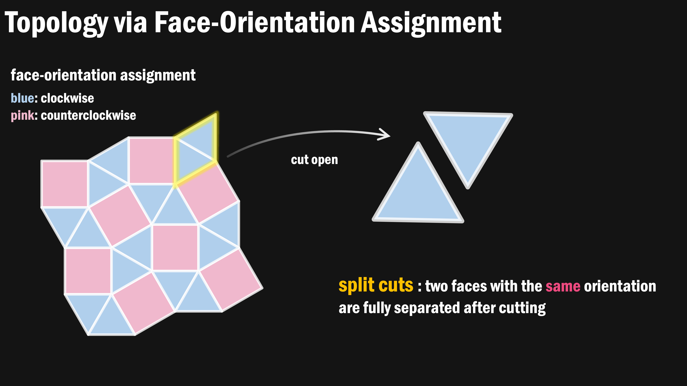
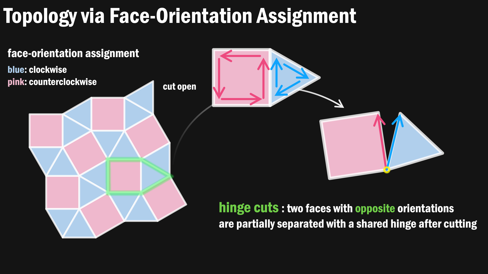
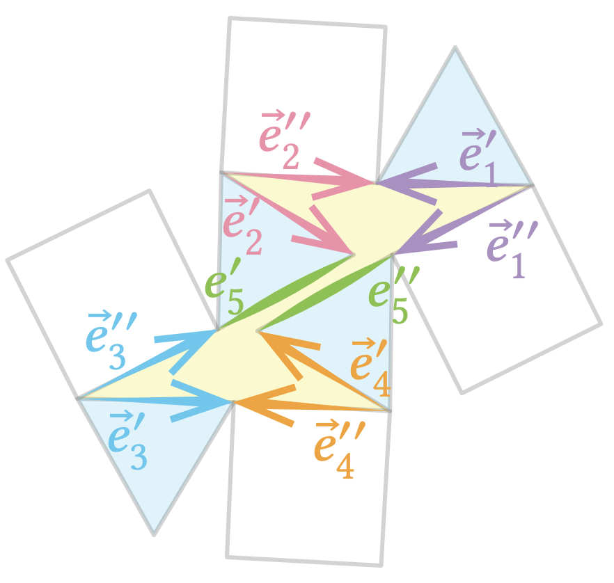
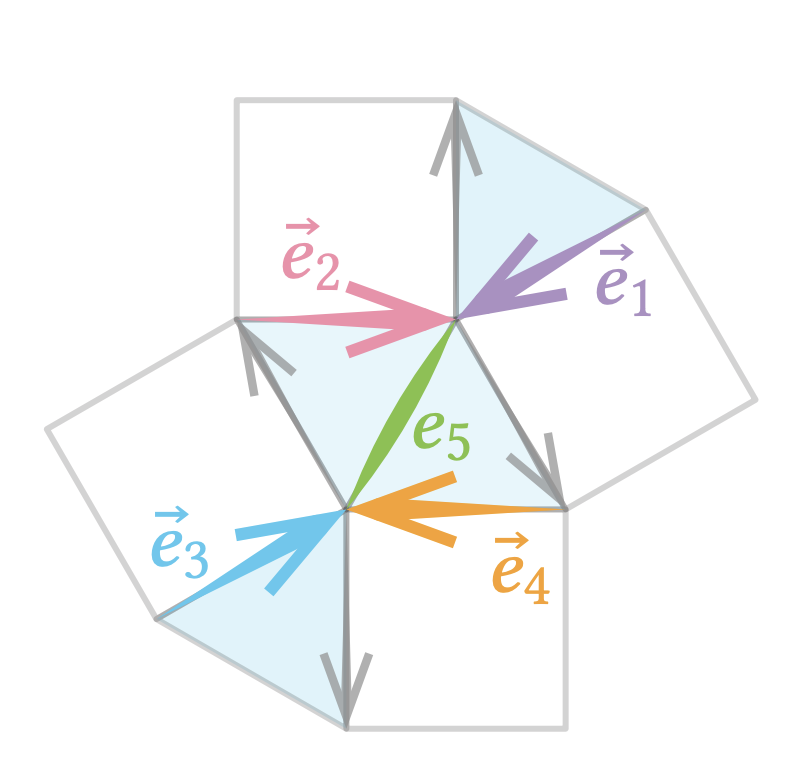
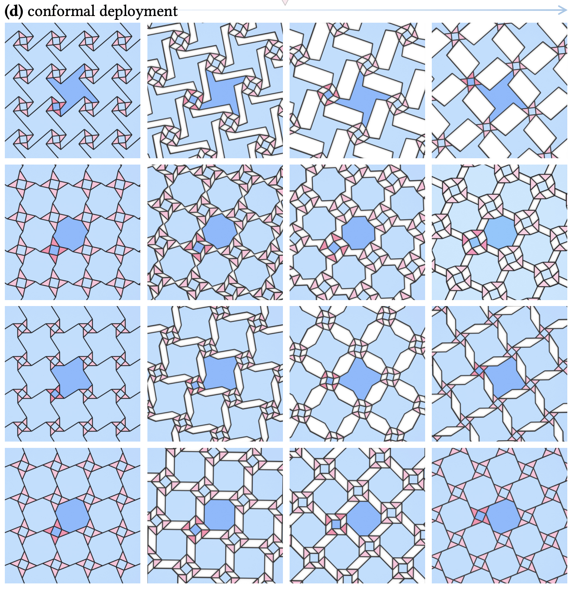
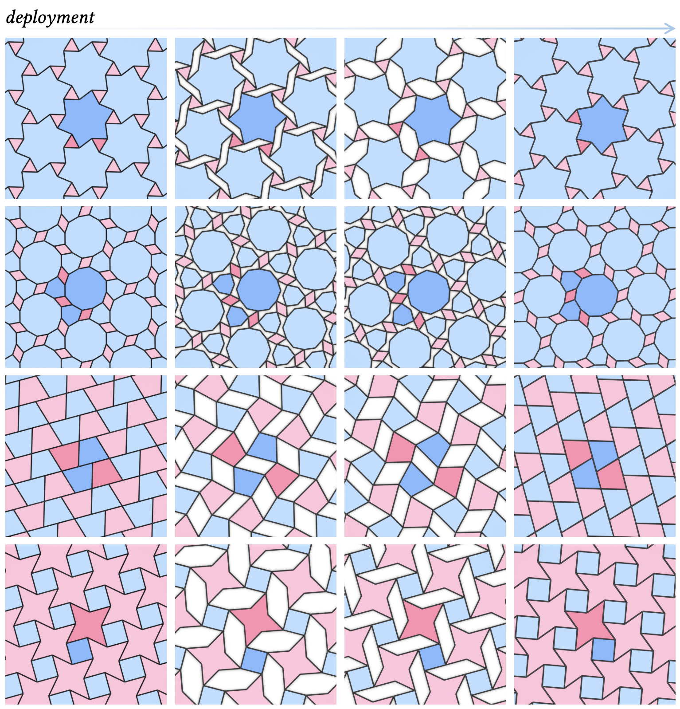
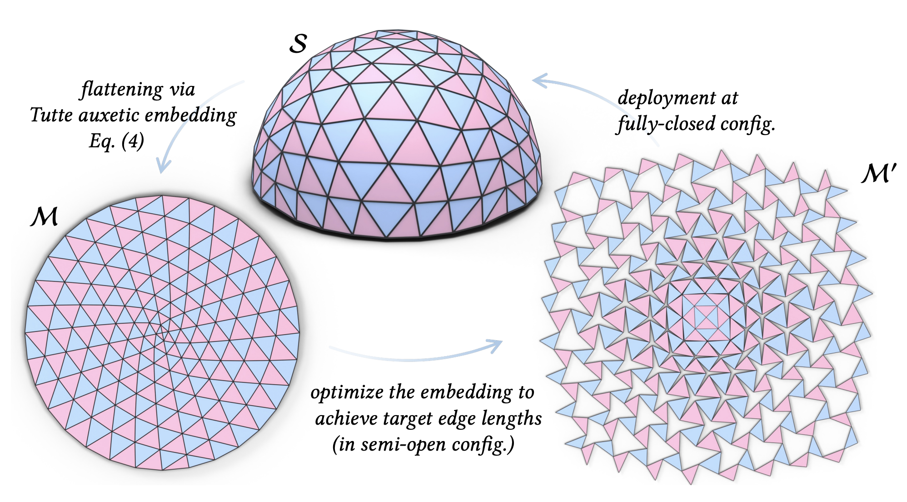
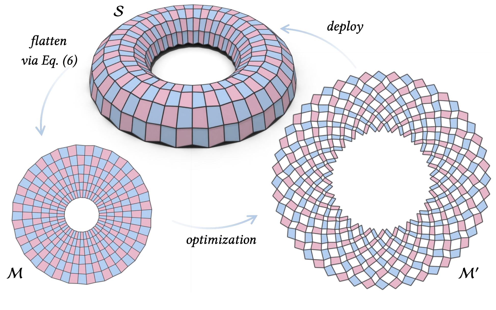

# Uniformly Deployable Kirigami on Arbitrary Planar Graphs

  

This repository contains the implementation for our paper **"Uniformly Deployable Kirigami on Arbitrary Planar Graphs"**, *ACM Transactions on Graphics (Proc. SIGGRAPH) 2026*, by [Aviv Segall](https://segaviv.github.io/), [Jing Ren](https://ren-jing.com/), and [Olga Sorkine-Hornung](https://igl.ethz.ch/people/sorkine).

In this project, we introduce a general analytical framework for designing uniformly deployable kirigami structures from **arbitrary planar graphs**, going beyond traditional 2‑colorable or quadrilateral patterns. Our method characterizes the full space of deployable embeddings via linear constraints (which we refer to as ***Tutte auxetic embeddings***), supports **shape space exploration** for pattern optimization and enables **inverse design** for 3D shape approximation from flat sheets. 

More details about our paper can be found at:  [[web demo]]() | [[project page]]() | [[paper]]() | [[suppl. video]](https://youtu.be/lAtOGjTt69o)

## Methodology
We represent a planar graph as a 2D tiling/mesh $M = (X, F)$ where the face list $F$ encodes the graph combinatorics and $X$ is a planar straight-line embedding (as we assume the graph is planar). We aim to answer the following questions:
1. How to formulate cut operations that transform a planar tiling into a kirigami structure?
2. What geometric conditions ensure uniform deployability of the resulting structure?
3. How to characterize the full space of embeddings that satisfy these conditions?

### Cut operations
We use face orientations to define cut operations. 
Specifically, a face-orientation assignment assigns clockwise (colored blue) or counterclockwise (color pink) orientation to each face. This orientation determines how adjacent faces are cut (which can be categorized as split cuts and hinge cuts). See illustration below:

| Figure 1: split cut | Figure 2: hinge cut |
|:--------------------------:|:--------------------------:|
|  |  |

The given face-orientation assignments partition the interior edges of $M$ into two groups:
- $\mathcal{E}_{\mathrm{hinge}}$: the set of interior edges undergoin hinge cuts, i.e., shared by two faces with opposite orientations.
- $\mathcal{E}_{\mathrm{split}}$: the set of interior edges undergoin split cuts, i.e., shared by two faces with the same orientations.

Applying split and hinge cuts to all interior edges based on the orientation of the adjacent faces yields a hinged kirigami structure.

### Uniform deployability

A kirigami structure is **uniformly deployable** if all hinge-cut edges open by the same angle $\theta$ during deployment, and all faces remain rigid. This property is governed by the geometry of *holes*, i.e., empty regions that emerge after cutting. We first define key concepts that connect the original tiling $M$ to the kirigami structure $M'$ after cutting:

**Definition 4.1 (Holes in $M'$).** A *hole* in the kirigami structure $M'$ is a connected component of the complement of $M'$ in the plane, whose boundary is a simple closed cycle composed of duplicated interior edges and hinge vertices introduced by the cutting process.

**Definition 4.2 (Hole preimage in $M$).** For an interior edge $e$ in the original mesh $M$, let $e'$ in $M'$ be one of its duplicates after cutting. The *hole preimage* of edge $e$ is the set of interior edges in $M$ whose corresponding edges in $M'$ collectively form the boundary of the hole that contains the edge $e'$.

  
| a hole in $M'$ | its hole preimage in $M$ |
|:-------------:|:--------------------:|
|  |  |

Intuitively, a hole preimage tells us which edges in the original uncut tiling contribute to the same hole after cutting. For each hole preimage $C$, uniform deployability requires:

$$\sum_{\vec{e} \in C \cap \mathcal{E}_{\mathrm{hinge}}} \vec{e} = \vec{0}$$

Please refer to our paper for more discussions and the proof. 
This vector sum condition is **linear** in the edge vectors, meaning the set of valid embeddings forms a linear subspace — the space of ***Tutte auxetic embeddings***.

### Shape space exploration
The linear system defining Tutte auxetic embeddings can be expressed as:

$$\mathbf{L} \mathbf{X} = \mathbf{0}$$

where $\mathbf{L}$ encodes hole constraints (defined above) and boundary conditions (e.g., fixed to predefined positions or constrained to be periodic). When the system is rank-deficient, its **null space** reveals a multi-dimensional shape space of valid embeddings (i.e., embeddings that are uniformly deployable). In such cases, we can further solve for patterns with additional constraints, such as requiring the resulting kirigami pattern to exhibit conformal behavior during deployment or to be fully closed (gap-free) at the maximum deployment angle.

| pattern optimization: conformal deployment | pattern optimization: fully closed at max-angle deployment|
|:-------------:|:--------------------:|
|  |  |

### Inverse design

  
| **inverse design: example 01**| **inverse design: example 02** |
|:-------------:|:--------------------:|
|  |  |

## Implementation
We provide an interactive **web‑based user interface** for pattern optimizationa and inverse design. Please see the [supplementary video](https://youtu.be/lAtOGjTt69o) for interactive demonstrations. 

Key features:
- Load a planar graph (default data folder: `data/unit_patterns/`) and automatically assign face orientations. 
- Interactively flip face orientations by clicking on faces.
- Compute the full design space and update a non-uniformly deployable pattern to its closest Tutte auxetic embedding.
- Adjust the coefficients of the basis vectors using sliders; the pattern updates in real time while remaining uniformly deployable.
- Simulate the deployment process with automatic detection of the deployment range.
- Solve for Tutte auxetic embeddings that are isotropic or fully-closed after deployment, with automatic collision handling.
- Draw custom curves and assign them to selected cut edges; the pattern updates with curved cuts.
- Load a disk-topology mesh and perform inverse design using the selected pattern.

Please refer to our paper for technical details. Full implementation can be found in the folder `web_demo`.  
Pre‑optimized patterns for various shapes are provided in `fabricable_results`. These patterns can be laser‑cut from paper, felt, or other sheet materials.

## Acknowledgements
The authors thank the anonymous reviewers for their valuable feedback.  Special thanks to **James MacCann** for insightful comments, and to **Ruben Wiersma**, **Marcel Padilla**, and **Peizhuo Li** for proofreading.  The authors thank all **IGL members** for their spiritual‑academic‑snacky support.  This work was supported in part by the **ERC Consolidator Grant No. 101003104 (MYCLOTH)**.

## Contact
Please let us know (`aviv.segall`, `jing.ren` @ `inf.ethz.ch`) if you have any questions regarding the algorithms/paper or if you find any bugs in the code (´；д；`)
This work is licensed under a [Creative Commons Attribution-NonCommercial 4.0 International License](http://creativecommons.org/licenses/by-nc/4.0/). For any commercial uses or derivatives, please contact us (`aviv.segall`, `jing.ren`, `sorkine` @ `inf.ethz.ch`).  

